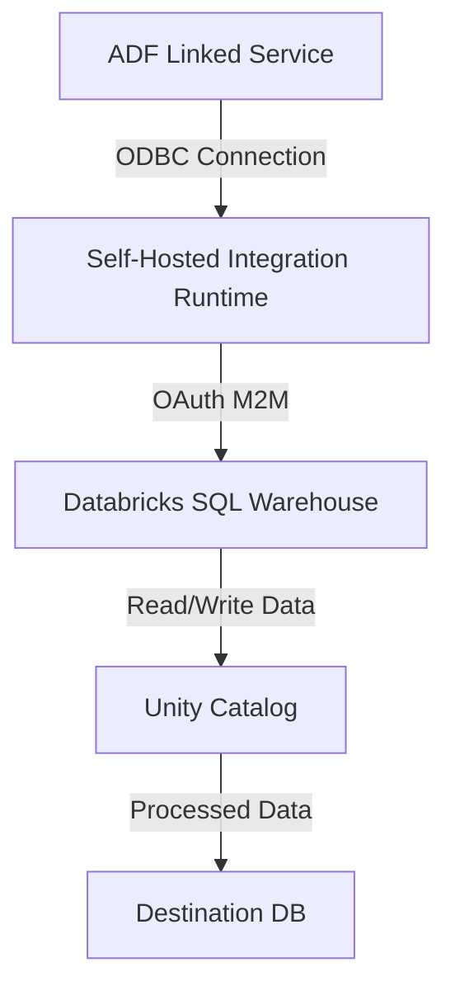

**Scenario:**

Azure Databricks for Data management  
Azure Data Factory for Orchestration or ingestion.



# Step-by-Step Implementation of Self-Hosted Integration Runtime
**Install and Configure SHIR**

a. Download SHIR:
- Go to the Azure Data Factory portal.
- Navigate to the "Manage" tab and select "Integration runtimes".
- Click on "New" and choose "Self-hosted" for the runtime type.
- Download the SHIR installation file.

b. Install SHIR:
- Run the downloaded installation file on your local or virtual machine.
- Follow the installation wizard to complete the setup.

c. Register SHIR with ADF:
- During installation, you'll get a registration key. Copy this key.
- Go back to the Azure Data Factory portal, and in the SHIR configuration, enter the registration key to link SHIR to your ADF instance.

**Install Databricks ODBC Driver on SHIR**

a. Download Databricks ODBC Driver:
- Download the ODBC driver from the Databricks website.

b. Install the Driver:
- Install the driver on the same machine where SHIR is installed.
- Follow the prompts to complete the installation.

**Configure OAuth M2M Authentication**

a. Register ADF Managed Identity in Databricks:
- In Databricks, navigate to the Admin Console and register the ADF Managed Identity.
- Grant necessary permissions for accessing Unity Catalog and SQL Warehouse.

b. Create OAuth Credentials:
- In Azure, create an application registration for OAuth.
- Generate client secrets and note them for later use.

**Build Connection String**

a. Create the ODBC Connection String:
- Use the format provided in the article to build your connection string. Include the driver path, host, port, HTTP path, SSL, and OAuth credentials.

Example:
```go
Driver={Simba Spark ODBC Driver};Host=adb-xxxx.azuredatabricks.net;Port=443;HTTPPath=/sql/1.0/warehouses/xxxx;SSL=1;ThriftTransport=2;AuthMech=11;Auth_Flow=1;Auth_Client_Id=xxxx;Auth_Client_Secret=xxxx
```
b. Store in Azure Key Vault:
- Store the connection string securely in Azure Key Vault.

**Create Linked Service in ADF**

a. Add New Linked Service:
- In the Azure Data Factory portal, go to "Manage" -> "Linked services".
- Add a new linked service and select "ODBC" as the type.

b. Configure Linked Service:
- Provide the connection string from Azure Key Vault.
- Ensure you select the correct driver and include the OAuth details.

Example Linked Service JSON:

```json
{
    "name": "DatabricksLinkedService",
    "type": "ODBC",
    "typeProperties": {
        "connectionString": "@Microsoft.KeyVault(SecretUri=https://<your-keyvault-name>.vault.azure.net/secrets/<secret-name>)"
    }
}
```

**Create ADF Pipeline**

a. Add Activities:
- Create a new pipeline in ADF.
- Add a "Copy Data" activity or "Databricks Notebook" activity as needed.

b. Configure Source and Sink:
- Configure the source to use the new linked service.
- Set up the destination (sink) as required, such as an Azure SQL Database or another data store.

  
**References:**

https://medium.com/@ivan.donev/note-from-the-trenches-securely-read-or-write-data-from-databricks-unity-catalog-using-azure-data-ab8e52d7c3e3

https://learn.microsoft.com/en-us/azure/data-factory/connector-azure-databricks-delta-lake?tabs=data-factory
